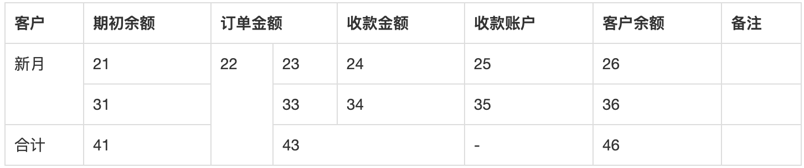

# web-crawl-util

前端页面爬虫工具库。

## 1. 安装

```bash
$ npm install web-crawl-util
```

## 2. API

### 2.1 useJquery

使用 jQuery 封装了一些常用操作。

#### 2.1.1 getText(jqCur, jqContainer)

获得文字信息。其最终会调用 jQuery 的 [.text()](http://api.jquery.com/text/) 方法。

- `jqCur`，css选择器或者jQuery对象，例如 '#id .css'
- `jqContainer`，祖先元素的css选择器或者jQuery对象

#### 2.1.2 getAttr(name, jqCur, jqContainer)

获得属性值。其最终会调用 jQuery 的 [.attr()](http://api.jquery.com/attr/) 方法。

- `name`，属性名字，例如 'href'
- `jqCur`，css选择器或者jQuery对象，例如 '#id .css'
- `jqContainer`，祖先元素的css选择器或者jQuery对象


#### 2.1.3 getTotal(jqCur, jqContainer)

获得符合条件的DOM数量。其最终会调用 jQuery 的 [.length](https://api.jquery.com/length/#length1) 方法。

- `jqCur`，css选择器或者jQuery对象，例如 '#id .css'
- `jqContainer`，祖先元素的css选择器或者jQuery对象


#### 2.1.4 isExist(jqCur, jqContainer)

是否存在。

- `jqCur`，css选择器或者jQuery对象，例如 '#id .css'
- `jqContainer`，祖先元素的css选择器或者jQuery对象


#### 2.1.5 getImageDomUrl(jqCur, jqContainer)

获得 img 标签中图片的地址。

- `jqCur`，css选择器或者jQuery对象，例如 '#id .css'
- `jqContainer`，祖先元素的css选择器或者jQuery对象


#### 2.1.6 getStyle(jqCur, jqContainer)

获得 dom 元素中的部分计算属性值

- `jqCur`，css选择器或者jQuery对象，例如 '#id .css'
- `jqContainer`，祖先元素的css选择器或者jQuery对象


返回对象:

| 属性          | 类型 |说明                 |
| ------------- | --- |  -------------------- |
| `width`      | `Number` | 元素宽度     |
| `height`      | `Number` | 元素高度     |
| `lineHeight`      | `Number` | 元素字体行高     |
| `isOneLine`      | `Boolean` | 判断是否是一行文字     |
| `computedStyle`      | `Object` | 计算之后的样式，使用 `document.defaultView.getComputedStyle(curDom)` 获得     |
| `isExist`      | `Boolean` | 是否存在     |


#### 2.1.7 getBackgroundImageUrl(jqCur, jqContainer)

获得 `background-image` 属性中图片的链接

- `jqCur`，css选择器或者jQuery对象，例如 '#id .css'
- `jqContainer`，祖先元素的css选择器或者jQuery对象

#### 2.1.8 getDataFromTable(jqCur, jqContainer)

获得 table 表格中的数据，返回一个二维数组。

- `jqCur`，css选择器或者jQuery对象，例如 '#id .css'
- `jqContainer`，祖先元素的css选择器或者jQuery对象

可以查看 [test/fixtures/table.html](./test/fixtures/table.html) 这个示例，执行后的结果为：



```js
// 目标结果
const targetResult = [
  ['客户', '期初余额', '订单金额', '订单金额', '收款金额', '收款账户', '客户余额', '备注'],
  ['新月', '21', '22', '23', '24', '25', '26', ''],
  ['新月', '31', '22', '33', '34', '35', '36', ''],
  ['合计', '41', '22', '43', '43', '-', '46', '']
];
```
